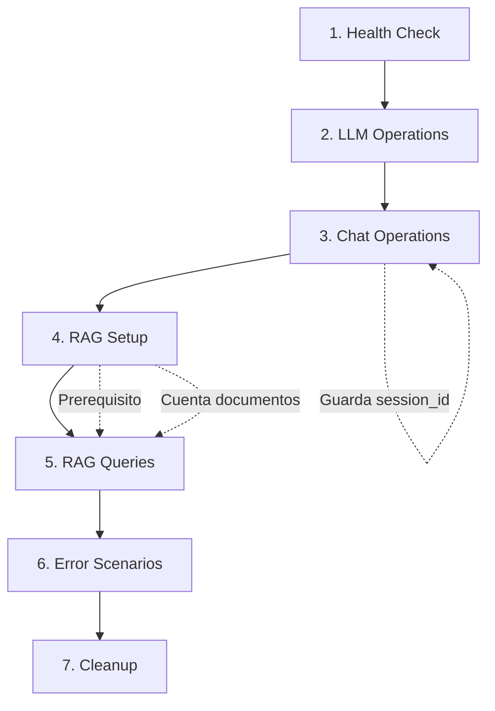

# Agent Lab API - Postman Test Suite

Colección completa de pruebas de API para Agent Lab usando Postman. Las pruebas están organizadas secuencialmente con dependencias entre requests y scripts de validación automatizados.

## 📁 Estructura de Archivos

```
tests/api/
├── .postman/
│   └── config.json                    # Configuración del workspace de Postman
├── postman/
│   ├── collections/
│   │   └── Agent_Lab_API.postman_collection.json  # Colección principal (27 requests)
│   ├── environments/
│   │   ├── development.postman_environment.json   # Ambiente local (localhost:8000)
│   │   └── production.postman_environment.json    # Ambiente producción
│   └── globals/
│       └── workspace.postman_globals.json         # Variables globales
└── fixtures/
    ├── sample_doc_1.txt               # Documento sobre Python (best practices)
    ├── sample_doc_2.md                # Documento sobre FastAPI
    └── sample_doc_3.txt               # Documento sobre SOLID principles
```

## 🎯 Organización de la Colección

La colección está dividida en **7 carpetas** con ejecución secuencial:

### 1. Health & Connectivity (2 requests)
- **Health Check**: Verifica que el servidor está corriendo
- **API Root Info**: Obtiene información sobre endpoints disponibles

### 2. LLM Basic Operations (4 requests)
- **Generate - Success**: Generación de texto con parámetros completos
- **Generate - With Defaults**: Usa valores por defecto (temperature, max_tokens)
- **Generate - Empty Prompt Error**: Valida rechazo de prompt vacío (422)
- **Generate - Invalid Temperature**: Valida parámetros fuera de rango (422)

### 3. Chat Operations (6 requests)
- **Chat - Basic**: Inicia sesión de chat (guarda `session_id`)
- **Chat - With Session ID**: Continúa conversación usando `session_id`
- **Chat - With System Message**: Prueba mensajes de sistema para guiar comportamiento
- **Chat - Invalid Role Error**: Valida roles válidos (user/assistant/system)
- **Chat - Missing Content Error**: Valida campo `content` requerido
- **Chat - Empty Messages Error**: Valida array de mensajes no vacío

### 4. RAG - Setup (3 requests)
**Prerequisito para sección 5**. Agrega documentos a la base de conocimiento:
- **Add Single Document**: Agrega texto plano directamente
- **Add Multiple Documents from Fixtures**: Agrega archivos desde fixtures
- **Add Directory (Fixtures)**: Procesa todo el directorio fixtures/

### 5. RAG - Query Operations (5 requests)
**Depende de sección 4**. Consultas sobre documentos indexados:
- **Query - Basic**: Consulta básica sobre Python
- **Query - About FastAPI**: Consulta específica sobre FastAPI
- **Query - About SOLID Principles**: Consulta sobre SOLID
- **Query - With High top_k**: Prueba con más documentos de contexto (top_k=10)
- **Query - Empty Query Error**: Valida rechazo de query vacío (422)

### 6. Error Scenarios (4 requests)
- **404 - Invalid Endpoint**: Endpoint inexistente
- **400 - Malformed JSON**: JSON inválido
- **422 - Missing Required Field**: Campo requerido faltante
- **422 - Invalid Parameter Type**: Tipo de dato incorrecto

### 7. Cleanup (2 requests)
- **Verify Documents Count Before Cleanup**: Log de documentos agregados
- **Clean Up - Delete Test Namespace**: Elimina namespace de pruebas

## 🚀 Configuración Inicial

### 1. Importar en Postman

#### Opción A: Importar desde archivos locales
1. Abrir Postman
2. Click en **Import** → **Folder**
3. Seleccionar `tests/api/postman/`
4. Importar colección y ambientes automáticamente

#### Opción B: Importar archivos individualmente
1. **Import** → **File**
2. Importar `collections/Agent_Lab_API.postman_collection.json`
3. Importar `environments/development.postman_environment.json`
4. Importar `environments/production.postman_environment.json` (opcional)

### 2. Configurar Variables de Ambiente

Seleccionar ambiente **"Agent Lab - Development"** y configurar:

| Variable | Valor | Tipo | Descripción |
|----------|-------|------|-------------|
| `base_url` | `http://localhost:8000` | default | URL del servidor API |
| `test_namespace` | `postman-test` | default | Namespace para datos de prueba en Pinecone |
| `fixtures_path` | `C:\Users\rdiaz\Documents\GitHub\ia-bootcamp-2005\tests\api\fixtures` | default | Ruta absoluta a fixtures |
| `openai_api_key` | `sk-...` | secret | Tu API key de OpenAI |
| `pinecone_api_key` | `...` | secret | Tu API key de Pinecone |

**Nota**: Las API keys se obtienen del archivo `.env` del proyecto (no es necesario duplicarlas en Postman si usas variables de entorno del sistema).

### 3. Iniciar el Servidor

Desde la raíz del proyecto:

```bash
# Activar entorno virtual (si usas uv)
uv sync

# Iniciar servidor FastAPI
uv run uvicorn agentlab.api.main:app --reload
```

El servidor debe estar corriendo en `http://localhost:8000` antes de ejecutar las pruebas.

## ▶️ Ejecución de Pruebas

### Ejecución Manual (Individual)

1. Seleccionar ambiente **"Agent Lab - Development"**
2. Abrir colección **"Agent Lab API"**
3. Ejecutar requests en orden secuencial:
   - Comenzar con carpeta **"1. Health & Connectivity"**
   - Continuar en orden numérico hasta **"7. Cleanup"**

### Ejecución Automática (Collection Runner)

#### Desde Postman Desktop:

1. Click derecho en colección → **Run collection**
2. Configurar:
   - **Environment**: Agent Lab - Development
   - **Iterations**: 1
   - **Delay**: 100ms (entre requests)
   - **Save responses**: ✓ (para debugging)
3. Click **Run Agent Lab API**

#### Desde Newman (CLI):

```bash
# Instalar Newman (si no está instalado)
npm install -g newman

# Ejecutar colección
newman run tests/api/postman/collections/Agent_Lab_API.postman_collection.json \
  -e tests/api/postman/environments/development.postman_environment.json \
  --delay-request 100 \
  --reporters cli,json \
  --reporter-json-export results.json
```

## 📊 Variables de Colección

Las siguientes variables se gestionan automáticamente durante la ejecución:

| Variable | Tipo | Uso |
|----------|------|-----|
| `session_id` | string | ID de sesión de chat (guardado en Chat - Basic) |
| `last_llm_response` | string | Última respuesta del LLM (para encadenamiento) |
| `documents_added` | number | Contador de documentos agregados a RAG |
| `test_timestamp` | string | Timestamp ISO de ejecución (generado automáticamente) |
| `rag_ready` | boolean | Flag que indica si RAG está listo para queries |

## ✅ Scripts de Validación

Cada request incluye **test scripts** que validan:

### Validaciones HTTP
```javascript
pm.test("Status code is 200", () => {
    pm.response.to.have.status(200);
});
```

### Validaciones de Estructura
```javascript
pm.test("Response has required fields", () => {
    const data = pm.response.json();
    pm.expect(data).to.have.property('text');
    pm.expect(data).to.have.property('prompt');
});
```

### Validaciones de Tipos
```javascript
pm.test("Response fields have correct types", () => {
    const data = pm.response.json();
    pm.expect(data.text).to.be.a('string');
    pm.expect(data.documents_added).to.be.a('number');
});
```

### Validaciones de Lógica de Negocio
```javascript
pm.test("Generated text is not empty", () => {
    const data = pm.response.json();
    pm.expect(data.text.length).to.be.above(0);
});
```

### Gestión de Variables (Pre-request Scripts)
```javascript
// Verificar prerequisitos
const ragReady = pm.collectionVariables.get("rag_ready");
if (ragReady !== "true") {
    console.error("❌ RAG not ready. Run '4. RAG - Setup' first.");
}
```

## 🔧 Troubleshooting

### ❌ Error: Connection refused (ECONNREFUSED)

**Causa**: El servidor no está corriendo.

**Solución**:
```bash
uv run uvicorn agentlab.api.main:app --reload
```

### ❌ Error: 500 - OpenAI API key not configured

**Causa**: Variable de entorno `OPENAI_API_KEY` no configurada.

**Solución**:
1. Crear archivo `.env` en raíz del proyecto:
   ```
   OPENAI_API_KEY=sk-your-key-here
   PINECONE_API_KEY=your-pinecone-key
   PINECONE_INDEX_NAME=agent-lab-index
   ```
2. Reiniciar el servidor

### ❌ Error: RAG queries fail (no documents found)

**Causa**: No se ejecutó la sección **"4. RAG - Setup"** antes de hacer queries.

**Solución**:
1. Ejecutar requests de carpeta **"4. RAG - Setup"** en orden
2. Verificar que `documents_added > 0` en variables de colección
3. Volver a intentar queries de carpeta **"5. RAG - Query Operations"**

### ❌ Error: Fixtures path not found

**Causa**: Variable `fixtures_path` en ambiente no apunta a la ruta correcta.

**Solución**:
1. Editar ambiente **"Agent Lab - Development"**
2. Actualizar `fixtures_path` a la ruta absoluta correcta:
   ```
   C:\Users\<tu-usuario>\Documents\GitHub\ia-bootcamp-2005\tests\api\fixtures
   ```
3. En Linux/Mac:
   ```
   /home/<usuario>/ia-bootcamp-2005/tests/api/fixtures
   ```

### ⚠️ Warning: Slow response (>5s)

**Causa**: Llamadas a LLM pueden ser lentas dependiendo del modelo y carga.

**Solución**: Normal en pruebas que usan LLM. Ajustar timeout en Postman si es necesario:
- **Settings** → **General** → **Request timeout**: 30000 ms

## 🧹 Limpieza Post-Ejecución

### Limpieza Automática

El request **"Clean Up - Delete Test Namespace"** intenta eliminar el namespace de pruebas.

**Nota**: Este endpoint puede no estar implementado aún. Si falla con 404, proceder con limpieza manual.

### Limpieza Manual en Pinecone

1. Login a [Pinecone Console](https://app.pinecone.io/)
2. Seleccionar tu index (ej: `agent-lab-index`)
3. Ir a **Namespaces**
4. Buscar namespace `postman-test`
5. Click **Delete namespace**

### Reset de Variables de Colección

Si necesitas resetear manualmente:

1. Abrir colección → **Variables** tab
2. Reset valores:
   - `session_id`: `""` (vacío)
   - `last_llm_response`: `""` (vacío)
   - `documents_added`: `0`
   - `rag_ready`: `"false"`

## 📝 Fixtures de Prueba

Los fixtures son documentos pequeños para pruebas aisladas y rápidas:

### sample_doc_1.txt (~ 150 líneas)
- Tema: **Python Programming Best Practices**
- Contenido: Features de Python, PEP 8, casos de uso

### sample_doc_2.md (~ 50 líneas)
- Tema: **FastAPI Framework Overview**
- Contenido: Features, ejemplo básico, casos de uso

### sample_doc_3.txt (~ 80 líneas)
- Tema: **SOLID Principles in Software Engineering**
- Contenido: Definición y ejemplos de cada principio SOLID

**Total**: ~280 líneas combinadas. Suficiente para pruebas sin sobrecarga.

## 🔄 Dependencias Entre Requests



**Importante**: 
- **RAG Queries (5)** depende completamente de **RAG Setup (4)**
- **Chat - With Session ID** depende de **Chat - Basic** para obtener `session_id`
- No ejecutar secciones fuera de orden en el primer run

## 📈 Resultados Esperados

### Ejecución Completa Exitosa

```
✓ Health Check                                    [200] 50ms
✓ API Root Info                                   [200] 45ms
✓ Generate - Success                              [200] 2500ms
✓ Generate - With Defaults                        [200] 2300ms
✓ Generate - Empty Prompt Error                   [422] 30ms
✓ Generate - Invalid Temperature                  [422] 25ms
✓ Chat - Basic                                    [200] 2800ms
✓ Chat - With Session ID                          [200] 2600ms
✓ Chat - With System Message                      [200] 2700ms
✓ Chat - Invalid Role Error                       [422] 28ms
✓ Chat - Missing Content Error                    [422] 26ms
✓ Chat - Empty Messages Error                     [422] 27ms
✓ Add Single Document                             [200] 1500ms
✓ Add Multiple Documents from Fixtures            [200] 2000ms
✓ Add Directory (Fixtures)                        [200] 2500ms
✓ Query - Basic                                   [200] 3000ms
✓ Query - About FastAPI                           [200] 3200ms
✓ Query - About SOLID Principles                  [200] 3100ms
✓ Query - With High top_k                         [200] 3500ms
✓ Query - Empty Query Error                       [422] 30ms
✓ 404 - Invalid Endpoint                          [404] 20ms
✓ 400 - Malformed JSON                            [400] 22ms
✓ 422 - Missing Required Field                    [422] 25ms
✓ 422 - Invalid Parameter Type                    [422] 28ms
✓ Verify Documents Count Before Cleanup           [200] 35ms
✓ Clean Up - Delete Test Namespace                [204/404] 100ms

────────────────────────────────────────────────────────────
Total: 27 requests
Passed: 27 (100%)
Failed: 0
Duration: ~45s (varies with LLM response times)
```

## 🎓 Mejores Prácticas

### 1. Ejecutar en Orden Secuencial
Las pruebas están diseñadas para ejecutarse en orden. No saltear carpetas en el primer run.

### 2. Revisar Console Logs
Cada request incluye `console.log()` con información útil:
```javascript
console.log("✅ Text generated successfully:", data.text.substring(0, 50) + "...");
console.log("📊 Total documents in RAG:", totalDocs);
```

### 3. Usar Collection Runner para CI/CD
Integrar con Newman en pipelines:
```yaml
# GitHub Actions example
- name: Run API Tests
  run: |
    newman run tests/api/postman/collections/Agent_Lab_API.postman_collection.json \
      -e tests/api/postman/environments/development.postman_environment.json \
      --reporters cli,junit \
      --reporter-junit-export results.xml
```

### 4. Verificar Cleanup
Siempre ejecutar carpeta **"7. Cleanup"** al finalizar para evitar acumulación de datos de prueba.

### 5. Documentar Cambios
Si se agregan nuevos endpoints a la API:
1. Agregar request correspondiente en la carpeta apropiada
2. Incluir test scripts con validaciones completas
3. Actualizar este README con la descripción del nuevo request

## 📚 Referencias

- **API Documentation**: [docs/api_endpoints.md](../../docs/api_endpoints.md)
- **Python Unit Tests**: [tests/unit/test_chat_routes.py](../unit/test_chat_routes.py)
- **Project Guidelines**: [AGENTS.md](../../AGENTS.md)
- **Postman Learning Center**: https://learning.postman.com/
- **Newman Documentation**: https://learning.postman.com/docs/running-collections/using-newman-cli/command-line-integration-with-newman/

## 🤝 Contribuir

Al agregar nuevas pruebas:

1. **Seguir la estructura de carpetas** existente (numeración secuencial)
2. **Incluir test scripts** completos (status, estructura, tipos, lógica)
3. **Agregar pre-request scripts** si hay dependencias
4. **Documentar en description** prerequisites y expected outcomes
5. **Actualizar este README** con el nuevo request

## 📞 Soporte

Si encuentras problemas:

1. Verificar que el servidor está corriendo
2. Revisar variables de ambiente configuradas correctamente
3. Ejecutar tests unitarios Python para aislar problema:
   ```bash
   make test-unit
   ```
4. Revisar logs del servidor:
   ```bash
   uv run uvicorn agentlab.api.main:app --reload --log-level debug
   ```

---

**Última actualización**: 2025-12-15  
**Versión colección**: 1.0.0  
**Requests totales**: 27  
**Carpetas**: 7
